# Kernel Development Explorer (KDE)

KDE 是一个基于 AI 的 Linux 内核开发分析工具集，使用 LangGraph 构建状态机工作流，集成 ModelScope Qwen3-235B-A22B 模型进行智能分析。

## 项目概述

KDE 提供三个核心分析能力：
- **LKML 补丁分析** - 分析 Linux 内核邮件列表中的（Linux Kernel Mailing List）补丁
- **CGit Commit 分析** - 分析 Linux 内核 Git 提交，并自动关联 patchset
- **RSS 文章分析** - 分析 Phoronix 和 LWN 等技术网站的文章

## 项目架构

### 整体架构图



**手绘风格架构图**：

如需查看手绘风格的架构图，请打开 `diagrams/overall-architecture.excalidraw.json` 文件：

1. 访问 https://excalidraw.com
2. 点击 "Open" 或拖放文件
3. 或使用 Excalidraw VS Code 扩展

**架构图说明**：

- **CLI 入口层**：kde.py 提供三个命令选项 --lkml、--rss、--cgit
- **Agent 层**：三个 LangGraph 状态机工作流（LKML、RSS、CGit）
- **模型层**：ModelScope Qwen3-235B-A22B 模型推理模块
- **缓存层**：统一的磁盘缓存系统（output/ 目录）
### 目录结构

```
kde/
├── kde.py                  # CLI 入口，统一命令行接口
├── .env                    # 环境配置（OPENAI_API_KEY 等）
├── README.md               # 本文件
│
├── lkml/                   # LKML 补丁分析模块
│   ├── lkml_agent.py       # LangGraph 工作流
│   ├── lkml.py             # 核心补丁分析器
│   ├── __init__.py
│   ├── get_b4_series.sh    # B4 系列获取辅助脚本
│   └── README.md
│
├── rss/                    # RSS 文章分析模块
│   ├── rss_agent.py        # LangGraph 工作流
│   ├── dual_rss_agent.py    # 双源分析（旧版）
│   ├── detect_anti_crawler.py  # 反爬虫检测
│   └── README.md
│
├── cgit/                   # CGit commit 分析模块
│   ├── cgit_agent.py       # LangGraph 工作流
│   ├── get_cgit_patch.sh    # CGit patch 获取辅助脚本
│   └── README.md
│
├── model/                  # AI 模型集成模块
│   ├── model_infer.py      # ModelScope 推理封装
│   ├── model_request.py    # 请求构建器
│   ├── model_api.py        # API 工具函数
│   ├── __init__.py
│   └── README.md
│
├── test/                   # 测试套件
│   ├── test_all.sh         # 主测试脚本
│   ├── test_all_commands.py # Python 测试框架
│   ├── test_lkml.sh        # LKML 测试
│   ├── test_rss.sh         # RSS 测试
│   ├── test_cgit.sh        # CGit 测试
│   ├── test_verbose.sh      # 详细模式测试
│   └── README.md
│
├── patchwork/              # PatchWork 集成脚本
│   ├── get_patchwork_project.sh
│   ├── get_patchwork_series.sh
│   ├── batch.sh
│   ├── project/
│   └── README.md
│
└── output/                 # 统一缓存目录
    ├── lkml/               # LKML 补丁缓存
    │   └── <message-id>/   # 按消息 ID 分组
    │       ├── <id>.cover  # Cover 文件
    │       └── <id>.mbx    # MailBox 文件
    ├── rss/                # RSS 文章缓存
    │   └── <hash-id>.txt   # 基于链接哈希的缓存文件
    └── cgit/               # CGit commit 缓存
        └── <commit-id>/    # 按 commit ID 分组
            └── <commit-id> # Commit 文件
```

## 核心功能

### 1. LKML 补丁分析

**架构图：**

```
┌──────────────────────────────────────────────────────────────┐
│                    LKML Agent 工作流                         │
│                   (LangGraph StateGraph)                     │
├──────────────────────────────────────────────────────────────┤
│                                                              │
│  ┌──────────────┐    ┌──────────────┐    ┌──────────────┐ │
│  │ fetch_patch  │───▶│ parse_patch  │───▶│generate_     │ │
│  │              │    │              │    │summary       │ │
│  │ - b4 am      │    │ - 提取作者   │    │ - AI 摘要    │ │
│  │ - 进度条     │    │ - �提取日期   │    │ - 300 字限制 │ │
│  │ - 超时处理   │    │ - 提取主题   │    │              │ │
│  └──────────────┘    └──────────────┘    └──────────────┘ │
│                                                  │           │
│                                                  ▼           │
│  ┌──────────────┐    ┌──────────────┐    ┌──────────────┐ │
│  │ output_      │◀───│ analyze_     │◀───│              │ │
│  │ results      │    │ patch        │    │              │ │
│  │ - Markdown   │    │ - AI 分析    │    │             只有 detail 级别│ │
│  │   表格输出   │    │ - 技术影响   │    │              │ │
│  └──────────────┘    └──────────────┘    └──────────────┘ │
│                                                              │
└──────────────────────────────────────────────────────────────┘
```

**功能特性：**
- 使用 `b4` 工具从 LKML 下载补丁
- 解析补丁元数据（作者、日期、主题、版本、message-id）
- AI 生成摘要（300 字限制）
- 详细模式下的深度技术分析
- Markdown 表格格式输出
- 支持进度条和详细日志
- 自动缓存到 `output/lkml/<message-id>/`

### 2. CGit Commit 分析

**架构图：**

```
┌──────────────────────────────────────────────────────────────┐
│                    CGit Agent 工作流                         │
│                   (LangGraph StateGraph)                     │
├──────────────────────────────────────────────────────────────┤
│                                                              │
│  ┌──────────────┐    ┌──────────────┐    ┌──────────────┐ │
│  │ fetch_commit │───▶│ parse_commit │───▶│analyze_      │ │
│  │              │    │              │    │commit        │ │
│  │ - wget       │    │ - 提取作者   │    │ - AI 摘要    │ │
│  │ - git.kernel │    │ - 提取日期   │    │ - AI（分析    │ │
│  └──────────────┘    └──────────────┘    └──────────────┘ │
│                                                  │           │
│                                                  ▼           │
│  ┌──────────────┐    ┌──────────────┐    ┌──────────────┐ │
│  │ output_      │◀───│ run_lkml_    │◀───│check_        │ │
│  │ results      │    │ analysis     │    │patchset      │ │
│  │ - Markdown   │    │ - 提取       │    │ - 提取 Link  │ │
│  │   表格输出   │    │   message-id │    │ - 正则匹配   │ │
│  └──────────────┘    └──────────────┘    └──────────────┘ │
│         │                     │                           │
│         │                     ▼                           │
│         │          ┌──────────────────┐                    │
│         │          │  LKML Agent      │                    │
│         │          │  (递归调用)      │                    │
│         │          └──────────────────┘                    │
│                                                              │
└──────────────────────────────────────────────────────────────┘
```

**功能特性：**
- 使用 `wget` 从 git.kernel.org 下载 commit
- 解析 commit 元数据
- AI 生成摘要和分析
- 自动提取 patchset 链接（Link 字段）
- 递归调用 LKML Agent 分析关联的 patchset
- Markdown 表格格式输出
- 自动缓存到 `output/cgit/<commit-id>/`

### 3. RSS 文章分析

**架构图：**

```
┌──────────────────────────────────────────────────────────────┐
│                    RSS Agent 工作流                          │
│                   (LangGraph StateGraph)                     │
├──────────────────────────────────────────────────────────────┤
│                                                              │
│  ┌──────────────┐    ┌──────────────┐    ┌──────────────┐ │
│  │ detect_      │───▶│ fetch_rss_   │───▶│fetch_article │ │
│  │ protection   │    │ feeds        │    │_content      │ │
│  │ - Cloudflare │    │ - feedparser │    │ - requests   │ │
│  │ - Turnstile  │    │ - 多源支持   │    │ - httpx      │ │
│  │ - 验证码     │    │              │    │ - Playwright │ │
│  └──────────────┘    └──────────────┘    └──────────────┘ │
│                                                  │           │
│                                                  ▼           │
│  ─────────────────────────────────────────────────────────   │
│         反爬虫绕过：                                    │
│         - 真实浏览器指纹                                │
│         - 鼠标移动和滚动模拟                           │
│         - Cookie 和 localStorage                        │
│         - 多步骤导航（Google → 目标）                  │
│  ─────────────────────────────────────────────────────────   │
│                                                  │           │
│                                                  ▼           │
│  ┌──────────────┐    ┌──────────────┐    ┌──────────────┐ │
│  │ output_      │◀───│ generate_    │◀───│analyze_      │ │
│  │ results      │    │ summaries    │    │articles      │ │
│  │ - Markdown   │    │ - AI 摘要    │    │ - 内核关键词 │ │
│  │   格式输出   │    │ - 分类       │    │ - 补丁链接   │ │
│  └──────────────┘    └──────────────┘    └──────────────┘ │
│                                                              │
└──────────────────────────────────────────────────────────────┘
```

**功能特性：**
- 支持多源（Phoronix、LWN）
- 反爬虫检测和绕过（Cloudflare、Turnstile）
- 三种 HTTP 后端：requests、httpx、Playwright
- Playwright 真实浏览器模拟
- 自动识别内核相关文章
- 提取补丁链接
- AI 生成摘要（内核文章详细摘要，其他简洁摘要）
- Markdown 格式输出
- **磁盘缓存** - 文章内容自动缓存到 `output/rss/<hash-id>.txt`

### 4. Model Inference 模块

**架构图：**

```
┌──────────────────────────────────────────────────────────────┐
│                 Model Inference Module                        │
├──────────────────────────────────────────────────────────────┤
│                                                              │
│  ┌──────────────────────────────────────────────────────┐  │
│  │              ModelRequest                             │  │
│  │  - set_request(type, content)                        │  │
│  │  - get_messages() → List[Dict]                       │  │
│  │                                                       │  │
│  │  类型:                                                │  │
│  │  - summary: 300 字限制摘要                            │  │
│  │  - analysis: 详细技术分析                            │  │
│  └──────────────────────┬───────────────────────────────┘  │
│                                                 │                                  │
│                         ▼                                  │
│  ┌──────────────────────────────────────────────────────┐  │
│  │              ModelInference                           │  │
│  │  - OpenAI Client (ModelScope API)                    │  │
│  │  - inference(messages) → str                         │  │
│  │  - Streaming with tqdm progress                      │  │
│  │                                                       │  │
│  │  配置:                                                │  │
│  │  - model: Qwen3-235B-A22B                            │  │
│  │  - temperature: 0 (greedy)                           │  │
│  │  - stream: True)                                     │  │
│  │  - extra_body: {enable_thinking: False}              │  │
│  └──────────────────────┬───────────────────────────────┘  │
│                         │                                  │
│                         ▼                                  │
│  ┌──────────────────────────────────────────────────────┐  │
│  │          ModelScope API (Qwen3-235B-A22B)             │  │
│  │  https://api-inference.modelscope.cn/v1/              │  │
│  └──────────────────────────────────────────────────────┘  │
│                                                              │
└──────────────────────────────────────────────────────────────┘
```

**功能特性：**
- OpenAI 兼容客户端
- 流式推理
- tqdm 进度条
- 温度控制（默认 0，贪心解码）
- 思考过程控制（可启用/禁用）

### 5. 磁盘缓存系统

**架构图：**

```
┌──────────────────────────────────────────────────────────────┐
│                    Disk Cache System                          │
├──────────────────────────────────────────────────────────────┤
│                                                              │
│  ┌──────────────────────────────────────────────────────┐  │
│  │  LKML Cache (output/lkml/)                             │  │
│  │  - 按消息 ID 分组存储                                  │  │
│  │  - 自动创建目录                                       │  │
│  │  - 支持 .cover 和 .mbx 文件                            │  │
│  └──────────────────────────────────────────────────────┘  │
│                                                              │
│  ┌──────────────────────────────────────────────────────┐  │
│  │  RSS Cache (output/rss/)                              │  │
│  │  - 基于文章链接的 MD5 哈希命名                         │  │
│  │  - 统一 .txt 格式                                      │  │
│  │  - 包含元数据（标题、链接、来源、时间）               │  │
│  └──────────────────────────────────────────────────────┘  │
│                                                              │
│  ┌──────────────────────────────────────────────────────┐  │
│  │  CGit Cache (output/cgit/)                            │  │
│  │  - 按 commit ID 分组存储                              │  │
│  │  - 自动创建目录                                       │  │
│  │  - 支持 commit 文件                                    │  │
│  └──────────────────────────────────────────────────────┘  │
│                                                              │
└──────────────────────────────────────────────────────────────┘
```

**功能特性：**
- **统一缓存目录** - 所有缓存集中在 `output/` 目录
- **自动创建** - 缓存目录和文件自动创建
- **持久化存储** - 缓存文件持久化，可重复使用
- **清理方便** - 使用 `git clean -fdX` 清理所有缓存

## 安装依赖

### 系统依赖

```bash
# Git
sudo apt-get install git

# B4 工具（用于 LKML 补丁下载）
pip install b4

# Wget（用于 CGit commit 下载）
sudo apt-get install wget
```

### Python 依赖

```bash
# 核心依赖
pip install langgraph requests beautifulsoup4 playwright tqdm feedparser httpx python-dotenv openai

# 安装 Playwright 浏览器
playwright install
```

### 环境配置

创建 `.env` 文件：

```bash
# ModelScope API Key
OPENAI_API_KEY=your-modelscope-api-key
```

## 使用方法

### LKML 补丁分析

```bash
# 简单模式（仅摘要）
python kde.py lkml <message-id> simple

# 详细模式（摘要 +）深度分析）
python kde.py lkml <message-id> detail

# 详细模式 + 进度条
python kde.py lkml <message-id> detail -v

# 详细模式 + 最详细日志
python kde.py lkml <message-id> detail -vvv
```

**示例：**

```bash
python kde.py lkml 20260122161647.142704-2-realwujing@gmail.com detail -v
```

### CGit Commit 分析

```bash
# 简单模式
python kde.py cgitkt <commit-id> simple

# 详细模式
python kde.py cgit <commit-id> detail

# 详细模式 + 进度条
python kde.py cgit <commit-id> detail -v
```

**示例：**

```bash
python kde.py cgit 53439363c0a111f11625982b69c88ee2ce8608ec detail -v
```

### RSS 文章分析

```bash
# 分析 Phoornix（默认 3 篇）
python kde.py rss phoronix

# 分析 LWN（限制 5 篇）
）
python kde.py rss lwn 5

# 分析 Phoronix + 进度条
python kde.py rss phoronix 5 -v

# 分析所有源
python kde.py rss
```

### Verbose 级别说明

| 级别 | 参数 | 行为 |
|------|------|------|
| 0 | 无 | 只显示简洁状态消息 |
| 1 | `-v` | 显示进度条和基本日志 |
| 2 | `-vv` | 显示详细日志和处理信息 |
| 3 | `-vvv` | 显示最详细的调试信息，包括所有命令输出 |

## 测试

### 运行所有测试

```bash
cd test
./test_all.sh
```

### 运行专项测试

```bash
# LKML 测试
./test_lkml.sh

# CGit 测试
./test_cgit.sh

# RSS 测试
./test_rss.sh

# 详细模式测试
./test_verbose.sh
```

## 技术亮点

1. **模块化设计** - 清晰的目录结构和职责分离
2. **LangGraph 状态机** - 可扩展的工作流架构
3. **反爬虫绕过** - 高级 Playwright 技术模拟真实浏览器
4. **统一 CLI 入口** - 简化用户交互
5. **进度条和日志控制** - 直观的用户反馈
6. **ModelScope 集成** - Qwen3-235B-A22B 智能分析
7. **磁盘缓存机制** - 统一的缓存目录（`output/`），支持持久化存储
8. **多代理集成** - LKML、CGit、RSS 无缝协作

## 代码规范

### 命名约定

- **函数**: `snake_case` (例如：`fetch_patch`, `parse_commit`)
- **类**: `CamelCase` (例如：`ModelInference`, `LKMLAgentState`)
- **状态类**: `CamelCase` + `State` 后缀 (例如：`LKMLAgentState`)
- **常量**: `UPPER_SNAKE_CASE` (例如：`ALL_RSS_SOURCES`)

### 导入模式

```python
import sys
import os
sys.path.append(os.path.join(os.path.dirname(__file__), '..'))
from model import ModelInference, ModelRequest
```

### 注释风格

- **双语注释**: 英文用于代码结构，中文用于领域逻辑
- **文档字符串**: 使用中文描述功能和使用方法

## 未来发展

### 功能扩展

- [ ] 扩展支持的 RSS 源（更多技术网站）
- [ ] 增强补丁分析能力（补丁系列分析）
- [ ] 添加可视化界面（Web/GUI）
- [ ] 集成更多 AI 模型
- [ ] 添加贡献指南

### 性能优化

- [ ] 优化下载和解析速度
- [ ] 改进模型推理效率
- [ ] 增强缓存机制（TTL、LRU）
- [ ] 支持并发处理

### 工程改进

- [ ] 添加 CI/CD 集成
- [ ] 迁移到 pytest 测试框架
- [ ] 添加测试覆盖率统计
- [ ] 改进错误处理和重试机制

## 许可证

MIT License
