# RSS Agent

## 项目介绍

RSS Agent 是一个基于 LangGraph 开发的智能 RSS 分析工具，用于自动获取、分析和总结 LWN 和 Phoronix 的技术文章。

## 项目架构

### 整体架构图



**手绘风格架构图**：

如需查看手绘风格的架构图，请打开 `../diagrams/rss-agent-new.excalidraw.json` 文件：

1. 访问 https://excalidraw.com
2. 点击 "Open" 或拖放文件
3. 或使用 Excalidraw VS Code 扩展

### 核心组件

```
rss/
├── rss_agent.py        # LangGraph 工作流
├── dual_rss_agent.py    # 双源分析（旧版）
├── detect_anti_crawler.py  # 反爬虫检测
└── README.md           # 本文件
```

### 工作流程

RSS Agent 的工作流程由以下几个主要步骤组成：

1. **检测防爬虫** (`detect_protection`) - 检测网站的反爬虫机制
2. **获取 RSS** (`fetch_rss_feeds`) - 获取 RSS 订阅内容
3. **获取文章内容** (`fetch_article_content`) - 获取文章完整内容
4. **分析文章** (`analyze_articles`) - 分析文章内容，检测是否涉及 Linux 内核
5. **生成摘要** (`generate_summaries`) - 使用 AI 生成文章摘要
6. **输出结果** (`output_results`) - 以 Markdown 格式输出分析结果

## 功能说明

### 主要功能

- **智能防爬虫检测** - 自动检测并选择最佳访问方式（requests、httpx、Playwright）
- **多源支持** - 支持 Phoronix 和 LWN 两个技术新闻源
- **内核识别** - 自动识别涉及 Linux 内核的文章
- **补丁链接提取** - 提取邮件列表中的补丁相关链接
- **AI 摘要生成** - 使用 ModelScope Qwen3-235B-A22B 模型生成高质量摘要
- **灵活配置** - 支持命令行参数自定义
- **进度条显示** - 在 verbose 模式下显示操作进度
- **详细日志控制** - 通过 verbose 级别控制日志输出的详细程度
- **磁盘缓存** - 文章内容自动缓存到 `output/rss/` 目录

### 技术实现

- **状态管理** - 使用 LangGraph 实现状态管理和工作流
- **防爬虫绕过** - 使用 Playwright 模拟真实浏览器行为
- **多 HTTP 后端** - 支持 requests、httpx、Playwright 三种访问方式
- **内容解析** - 使用 feedparser 和 BeautifulSoup4 解析 RSS 和 HTML
- **模型推理** - 集成 ModelScope Qwen3-235B-A22B 模型进行摘要生成
- **结果展示** - 以 Markdown 格式展示分析结果
- **进度条实现** - 使用 tqdm 库实现进度条显示
- **日志控制** - 通过 verbose 级别参数控制日志输出
- **缓存系统** - 基于文章链接哈希的磁盘缓存，支持持久化存储

## 使用说明

### 通过 kde.py 调用

RSS Agent 主要通过 kde.py 进行调用，支持以下命令格式：

#### 分析 Phoronix 文章（默认 3 篇）

```bash
python3 ../kde.py rss phoronix
```

#### 分析 LWN 文章，限制 5 篇

```bash
python3 ../kde.py rss lwn 5
```

#### 分析 Phoronix 文章，显示进度条

```bash
python3 ../kde.py rss phoronix 5 -v
```

#### 分析 Phoronix 文章，显示最详细的日志

```bash
python3 ../kde.py rss phoronix 5 -vvv
```

### 直接调用

也可以直接调用 rss_agent.py 进行测试：

```bash
# 获取所有源的所有文章
python3 rss_agent.py --resource Phoronix LWN

# 只获取 Phoronix 的文章
python3 rss_agent.py --resource Phoronix

# 只获取 LWN 的文章
python3 rss_agent.py --resource LWN

# 限制获取的文章数量
python3 rss_agent.py --max-articles 5

# 组合使用
python3 rss_agent.py --resource Phoronix --max-articles 10
```

### 参数说明

| 参数 | 短参数 | 说明 | 可选值 | 默认值 |
|------|--------|------|--------|--------|
| `--resource` | `-r` | 指定 RSS 源 | Phoronix, LWN | Phoronix, LWN |
| `--max-articles` | `-n` | 限制获取的文章数量 | 整数 | 无限制默认 3 |
| `-v, --verbose` | `-v` | 详细模式，显示进度条和详细日志 | 多次使用增加详细程度 | 0 |

## 依赖关系

### 内部依赖

- **model/model_infer.py** - 模型推理实现
- **model/model_request.py** - 某型请求构建

### 外部依赖

- **langgraph** - 用于构建状态管理和工作流
- **feedparser** - 用于 RSS 解析
- **requests/httpx** - 用于 HTTP 请求
- **BeautifulSoup4** - 用于 HTML 解析
- **Playwright** - 用于浏览器自动化和反爬爬虫绕过
- **tqdm** - 用于显示进度条

## 缓存机制

文章内容会自动缓存到 `output/rss/` 目录：

```
output/rss/
└── {hash-id}.txt   # 基于文章链接的 MD5 哈希

### 缓存特性

- **自动创建** - 缓存目录和文件自动创建
- **持久化存储** - 缓存文件持久化，可重复使用
- **哈希命名** - 基于文章链接的 MD5 哈希命名，避免重复
- **元数据包含** - 缓存文件包含标题、链接、来源、时间等元数据
- **清理方便** - 使用 `git clean -fdX` 可以清理所有缓存

### 缓存文件格式

```
标题: {article_title}
链接: {article_link}
来源: {article_source}
时间: {published_date}

{separator}

{article_content}
```
## 注意事项

1. **网络连接** - 确保网络连接正常，能够访问 Phoronix 和 LWN
2. **API 配置** - 确保 ModelScope API 密钥正确配置
3. **防爬虫限制** - 某些网站可能限制自动化访问，建议合理设置请求间隔
4. **文章数量** - 大量文章获取可能需要较长时间，建议使用 `--max-articles` 限制数量
5. **缓存管理** - 文章内容会自动缓存到磁盘，重复运行时会使用缓存

## 扩展计划

### 功能扩展

- 扩展支持的 RSS 源（更多技术网站）
- 增强文章分类和标签功能
- 添加文章去重和相似度检测
- 支持自定义摘要模板

### 性能优化

- 优化文章下载和解析速度
- 改进模型推理效率
- 增强缓存机制（TTL、LRU）
- 支持并发下载多篇文章

### 用户体验

- 添加更多命令行选项
- 提供更详细的输出格式
- 支持结果导出为不同格式
- 增强进度条和日志的用户体验

## 代码规范

### 命名约定

- **函数**: `snake_case` (例如：`fetch_rss_feeds`, `analyze_articles`)
- **类**: `CamelCase` (例如：`AgentState`)
- **常量**: `UPPER_SNAKE_CASE`

### 注释风格

- **双语注释**: 英文用于代码结构，中文用于领域逻辑
## 许可证

MIT License
